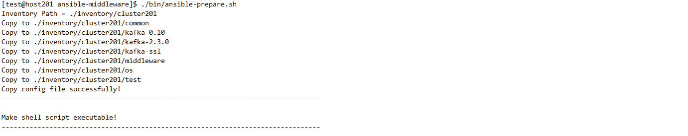

# 概述
> 学习与工作中经常要安装一些中间件、应用软件，同时也要配置好操作系统的环境。对于开发人员来说，这些过程的往往要投入不少的时间。  
> 通过ansible可以实现快速的安装，开发过程可以有更关注于代码实现、源代码分析、业务逻辑理解等更重要的工作。

# ansible脚本的配置
## 应用服务器
本脚本根据ansible.cfg中的inventory配置项信息选择配置文件的地址。  
本脚本以'inventory/cluster201'文件夹下的配置为示例，包括：
* 修改主机配置'hosts'
* 修改全局配置'hosts-configs-all'
* 修改各应用软件配置hosts-configs-xxx

### 修改主机配置'hosts'
配置应用服务器ip地址

### 修改全局配置'hosts-configs-all'
* 修改安装用户，用户组配置等
* 修改初始化操作系统一些配置等，参见'初始化操作系统'章节。
* 修改ansible脚本用到软件下载的目录，示例中用软件   
链接：https://pan.baidu.com/s/1YvgPdBGOPXfEdG7EkXGB7A  
提取码：o9jh

### 修改各应用软件配置hosts-configs-xxx
通常情况下配置文件common目录下，为了避免同一个中间件不同版本之间配置相互影响。  
比如kafka的不同版本就在目录kafka-0.10，kafka-2.3.0目录下。  

根据要安装的软件，修改中间件的配置，如：  
* host-config-hadoop  
* host-config-hive  
* host-config-flink  
* host-config-kafka  
* host-config-zookeeper  
* host-config-etcd  
* ...  

### 约束说明
> 最新的脚本只在CentOS 7.5.1804，ansible 2.9.17上做过严格测试。

# 脚本准备工作  
> 配置公共

> bin目录下存放着一些已经简化过的脚本，可以方便脚本的使用。在使用之前先运行如下脚本：
```
./bin/ansible-prepare.sh
```


## 运行脚本的两种方式
下面的例子以ansible-playbook的命令为主  
### 方法1：直接采用ansible-playbook的命令  
```
ansible-playbook 01.jdk.yaml -t install
```
### 注意点：  
> 以下ansible-playbook的示例脚本中均省略了指标inventory部分的内容，如'-i ./inventory/cluster201/xxxx'。
> xxxx到对应inventory目录找到对应的文件夹。
### 方法2：用简化的命令
```
./bin/role-jdk.sh -t install
```
# 安装准备
## 初始化操作系统(os)
hosts-configs-all中是否设置操作系统的初始化（yes表示开启），接着运行安装命令。

可支持的设置如下：  
* 是否关闭操作系统selinux  
* 是否关闭防火墙  
* 是否修改操作系统最大进程数和最大文件打开数限制  
* 是否修改内核参数  
* 是否进行时钟同步  

运行安装命令：
```
ansible-playbook 01.os.yaml -t install
```
## JDK安装
hosts-configs-all中配置jdk_install_home等变量后，运行安装命令。  
运行安装命令：
```
ansible-playbook 01.jdk.yaml -t install
```

## 应用服务器间的免密
脚本支持两种情况：应用服务器之间的相互免密，以及部署服务器到应用服务器的免密。
### 应用服务器创建密钥
```
ansible-playbook 01.crypo.yaml -t create
```
### 应用服务器之间的相互免密(直接包括了创建密钥)
```
ansible-playbook 01.crypo.yaml -t dispatch
```
### 部署服务器到应用服务器的免密
```
ansible-playbook 01.crypo.yaml -t deploy-dispatch
```
### 删除部署服务器与应用服务器的.ssh目录下内容
```
ansible-playbook 01.crypo.yaml -t delete
```

## kerberos的安装
```
# 安装kerberos KDC
# 同时将服务端生成的/etc/krb5.conf复制到ansible的安装目录下，其用于客户端命令分发
ansible-playbook 01.kerberos-server.yaml -t install
./bin/role-kerberos-server.sh -t install
# 创建与初始化kerberos数据库
./bin/role-kerberos-server.sh -t create-db
# 启动kerberos数据库
./bin/role-kerberos-server.sh -t start
# 创建主体并生成keytab, 生成在kerberos服务端的/tmp目录下
./bin/role-kerberos-server.sh -t create-princ
./bin/role-kerberos-server.sh -t create-keytab

# 安装kerberos客户端
./bin/role-kerberos-client.sh -t install
# 分发keytab到各客户端（create-keytab命令需要运行后）
# 需要分发的keytab在参数kerberos_keytab_name中配置
./bin/role-kerberos-client.sh -t dispatch
```

## ssl的安装
ssl的生成，根据不同的应用对应到不同的inventory目录。比如kafka中ssl的安装对应的就是kafka-ssl目录。
示例中对应的invertory目录是inventory/cluster201/kafka-ssl
### SSL生成的准备工作
```
# 生成ssl文件存放的目录(-i的参数根据不同的应用进行调整)；如果生成的目录要求root权限，则需要通过参数-b进行提权。
ansible-playbook 01.ssl.yaml -t prepare
# 或者可以用bin目录下简化shell脚本：
./bin/kafka2-ssl.sh -t prepare
# 需要提权时，命令如下
./bin/kafka2-ssl.sh -t prepare -b
```
### 生成SSL相关文件的操作
```
# 生成CA的私钥、证书（直接在部署机生成，再分发到应用服务器）
ansible-playbook 01.ssl.yaml -t ca
# 生成服务端、客户端的truststore（直接在部署机生成，再分发到应用服务器）
ansible-playbook 01.ssl.yaml -t ts
# 生成服务端、客户端的keystore（客户端的keystore直接在部署机生成，再分发到应用服务器；服务端的keystore分别在对应的应用服务器上生成）
ansible-playbook 01.ssl.yaml -t ks
# 也可以一次性生成CA的私钥、证书；生成服务端、客户端的truststore；生成服务端、客户端的keystore
ansible-playbook 01.ssl.yaml -t install
```
### 删除SSL相关文件的操作
```
# 删除CA的私钥、证书
ansible-playbook 01.ssl.yaml -t delete-ca
# 删除服务端、客户端的truststore
ansible-playbook 01.ssl.yaml -t delete-ts
# 删除服务端、客户端的keystore
ansible-playbook 01.ssl.yaml -t delete-ks
# 也可以一次性删除CA的私钥、证书；生成服务端、客户端的truststore；生成服务端、客户端的keystore
ansible-playbook 01.ssl.yaml -t delete
```

# 应用安装
## flink安装
### 安装步骤
本脚本支持HA
```
ansible-playbook 02.hadoop.yaml -t install 
```
### 启动
```
ansible-playbook 02.hadoop.yaml -t install 
```
### 说明事项
#### 1. 版本调整
修改invertory目录下hosts-configs-flink文件中的配置项
* flink_version
* flink_shaded_hadoop_jar 
##### 比如1.8配置如下
```
flink_version = 1.8.1
flink_shaded_hadoop_jar = "flink-shaded-hadoop-2-uber-2.8.3-8.0.jar"
```
##### 比如1.9配置如下
```
flink_version = 1.9.2
flink_shaded_hadoop_jar = "flink-shaded-hadoop-2-uber-2.8.3-9.0.jar"
```
##### 比如1.10配置如下
```
flink_version = 1.10.0
flink_shaded_hadoop_jar = "flink-shaded-hadoop-2-uber-2.8.3-10.0.jar"
```
#### 2. HA配置说明
flink_ha高可用(HA)的变量，使用时配置zookeeper，不需要时配置NONE，如下
```
# 不采用'高可用'
flink_ha = NONE
# 或者，采用'高可用'
flink_ha = zookeeper
```
flink_ha选择zookeeper，不仅需要配置zk的地址，还需要配置hadoop集群的resource manager（HA的信息存储在hdfs）
```
# hadoop集群的resource manager（HA的信息存储在hdfs）
flink_resource_manager = 192.168.128.201:9000
# 
flink_ha_zookeeper_quorum = 192.168.128.201:2181
```
如果zk不是独立使用的，在zk路径上加上一个数据说明，如
```
flink_ha_zookeeper_quorum = 192.168.128.201:2181/xxxxx
```
#### 3. 开启historyserver
需要开启historyserver时，需要设置flink_run_historyserver为true。  
```
flink_run_historyserver = true
```
## hadoop安装
本脚本支持kb的安装
```
# hadoop2的基本安装
./bin/role-hadoop2.sh -t install
# 需要提权到root用户下的一些安装步骤，需要通过参数-b进行提权。操作container-executor.cfg生成等内容。
./bin/role-hadoop2.sh -t install-root -b
# 如果开启SSL，还需要运行下面的语句生成ca证书与密钥，以及密钥库等
./bin/role-hadoop2.sh -t install-ssl -b
# 格式化datanode
./bin/role-hadoop2.sh -t format
# 生成yarn的cgroup，用于资源控制，需要通过参数-b进行提权
./bin/role-hadoop2.sh -t install-cgroup -b
# 启动hadoop
./bin/role-hadoop2.sh -t start
```

## hive安装
### 安装与初始化
```
ansible-playbook 02.hive.yaml -t install
# 初始化metastore的数据
ansible-playbook 02.hive.yaml -t init
```
### 注意点  
在初始化之前需要在mysql数据库进行建库、授权等操作。
```
create database hivedb;
grant all privileges on hivedb.* to 'hiveuser'@'%' with grant option;
```

### 启动与停止等操作
启动前需要hive的启动用户有操作hdfs上/tmp，/user目录的权限。
```
ansible-playbook 02.hive.yaml -t start
ansible-playbook 02.hive.yaml -t stop
```

## zookeeper安装
```
ansible-playbook 02.hive.yaml -t install
ansible-playbook 02.hive.yaml -t start
```

## kafka安装
### 安装步骤
```
ansible-playbook 02.kafka.yaml -t install
```
### 启动
```
ansible-playbook 02.kafka.yaml -t start 
```
### 创建与删除主题
修改invertory目录下hosts-configs-kafka文件中的配置项
* kafka_topic表示主题名
* kafka_replication表示复本数
* kafka_partition表示分区数

以上三个配置项是都是列表的结构（用中括号表示），配置项的相同索引位置的配置组合表示一个主题的相关信息。  
如下所示：bigdata主题，有一个复本数，三个分区。  
```
kafka_topic = ['bigdata','test','mytest']
kafka_replication = [1,1,1]
kafka_partition = [3,2,1]
```
运行命令创建
```
# 新建主题
ansible-playbook 02.kafka.yaml -t createtopic
# 删除主题 
ansible-playbook 02.kafka.yaml -t deletetopic 
```
### 其他命令
```
# 停止kafka
ansible-playbook 02.kafka.yaml -t stop 
# 卸载kafka
ansible-playbook 02.kafka.yaml -t uninstall 
```
### 说明事项
#### 1. 版本调整
修改invertory目录下hosts-configs-kafka文件中的配置项，已验证版本1.1.1，2.3.0：
* kafka_version
* kafka_scala_version
#### 2. 部署多个kafka注意事项  
如果两个kafka同时使用一个zookeeper的情况，还要修改如下zk根路径配置，让两个kafka集群的配置不会相互干扰：
* kafka_zk_root

## etcd安装
etcd常用的几个命令
```
# 安装 
ansible-playbook 03.etcd.yaml -t install
# 启动
ansible-playbook 03.etcd.yaml -t start
# 压缩与去碎片化
ansible-playbook 03.etcd.yaml -t compact
# 卸载
ansible-playbook 03.etcd.yaml -t stop
```
etcd也支持备份与恢复。本脚本为了简化只保留一个备份。
```
# 备份。会在部署机的software/snapshot目录下生成snapshot.db文件，用于需要时恢复。
ansible-playbook 03.etcd.yaml -t i snapshot

# 当需要恢复时，可以调用restore命令。
ansible-playbook 03.etcd.yaml -t restore
# 恢复后，需要再重新启动下。
ansible-playbook 03.etcd.yaml -t start
```

## redis安装
本安装主要适用于Redis cluster的安装。暂不支持单机与哨兵模式的安装。  
如果一台服务器要用多个实例，则redis_ports可以用英文逗号多个实例端口。  
注意：集群安装时至少3个实例。
```
# 安装 
ansible-playbook 03.redis.yaml -t install
# 启动
ansible-playbook 03.redis.yaml -t start
# 创建集群
ansible-playbook 03.redis.yaml -t create-cluster
# 查看集群信息
ansible-playbook 03.redis.yaml -t cluster-info
# 停止
ansible-playbook 03.redis.yaml -t stop
# 卸载
ansible-playbook 03.redis.yaml -t uninstall
```

## pulsar安装
本安装主要适用于Pulsar cluster的安装。暂不支持单机与哨兵模式的安装。  
如果一台服务器要用多个实例，则redis_ports可以用英文逗号多个实例端口。  
```
# 安装 
ansible-playbook 02.pulsar.yaml -t install
# 初始化集群(主要是在ZK上注册信息)
ansible-playbook 02.pulsar.yaml -t init
# 启动集群(包括zookeeper, bookkeeper, broker)
ansible-playbook 02.pulsar.yaml -t start
# 停止集群
ansible-playbook 02.pulsar.yaml -t stop
# 升级集群(包括停止,安装,启动)
ansible-playbook 02.pulsar.yaml -t upgrade
# 卸载
ansible-playbook 02.pulsar.yaml -t uninstall

# 简化的安装脚本（同时完成停止、清空目录、安装、初始化）  
pulsar-install.sh  
```

## elasticsearch安装
```
ansible-playbook 03.elasticsearch.yaml -t install
ansible-playbook 03.elasticsearch.yaml -t start
```

## clickhouse安装
clickhouse的启停依赖于系统，所以启停要加上-b。
```
ansible-playbook 03.clickhouse.yaml -t install-root -b  
ansible-playbook 03.clickhouse.yaml -t install  
ansible-playbook 03.clickhouse.yaml -t start -b 
ansible-playbook 03.clickhouse.yaml -t stop -b
```

## tez安装
tez的安装，包括环境变量的设置，包上传hdfs。
```
# 安装tez 0.9
./bin/role-tez.sh -t install
# 安装tez 0.10
./bin/role-tez-3.sh -t install
```

## dolphin2.0.x安装
dolphin因为本身提供了install.sh的脚本，该ansible脚本暂时只提供安装软件的推送、配置与脚本文件的生成。  
同时为了更方便的看到脚本的标准输出，可以直接到安装软件的目录下运行脚本：
```
# 安装：在安装软件的目录下（变量dolphin_home的目录下），运行脚本：
install.sh

# 启停：在实际部署软件的目录下（变量dolphin_real_install_path的目录下），运行脚本：
./bin/start.sh
./bin/stop.sh
```
注意：  
如果资源中心采用HDFS 
roles/dolphin/templates/hadoop目录中加入如下文件：
* krb5.conf (如果启用kb)
* core-site.xml
* hdfs-site.xml
* yarn-site.xml
* mapred-site.xml  

roles/dolphin/files目录中加入如下文件：
* xxxx.keytab (如果启用kb)  

# 说明
